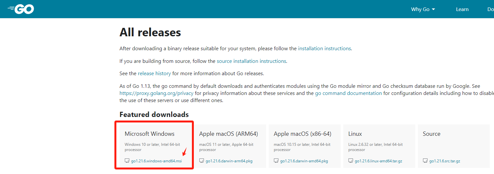

# Golang 学习总结

## 1 Golang 安装

>国内：[go语言中文网](https://studygolang.com/dl) （推荐）
>
>国外：[go语言官网](https://go.dev/dl/)

### 1.1 Linux

```bash
# 下载 Go1.20.10 （国内）
wget -c https://studygolang.com/dl/golang/go1.20.10.linux-amd64.tar.gz -O - | sudo tar -xz -C /usr/local
# 添加环境变量
echo "export PATH=$PATH:/usr/local/go/bin" >> ~/.bashrc && source ~/.bashrc
```

### 1.2 Windows

如图，双击链接，按照提示安装即可。


